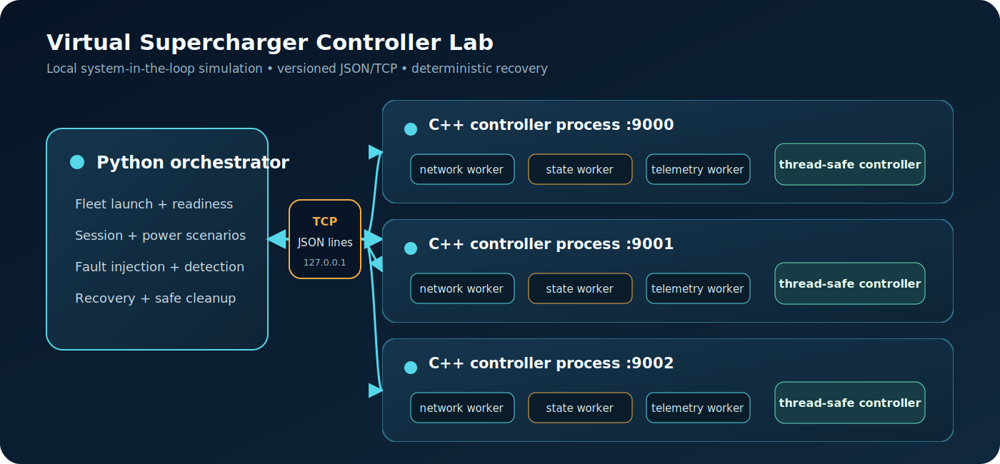
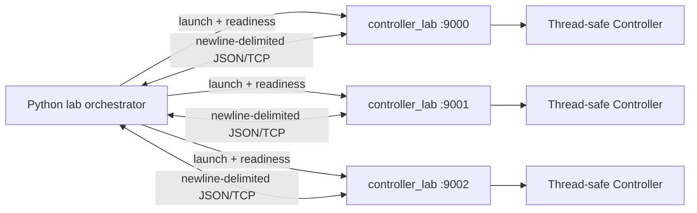
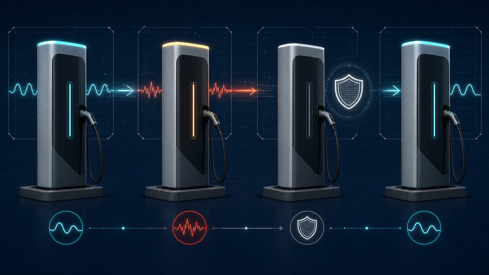

# Virtual Supercharger Controller Lab

[](https://github.com/TarunT27/virtual-supercharger-controller-lab/actions/workflows/tests.yml)
[](https://isocpp.org/)
[](https://www.python.org/)
[](LICENSE)


A dependency-light system-in-the-loop lab for testing high-power EV charging controller behavior before real hardware is available. A thread-safe C++20 controller daemon exposes a bounded JSON-over-TCP protocol; a Python control plane launches isolated fleets, drives charging sessions, injects transport faults, verifies safe failure, and proves recovery.

This is an original educational simulator. It is not affiliated with Tesla or any charger manufacturer, does not use proprietary Tesla protocols, and must not be used to control real vehicles or charging equipment.

## What works

- Real loopback TCP communication between Python and C++ processes
- Independent multi-controller fleets with configurable IDs, ports, and power limits
- Session start, power allocation, telemetry snapshots, normal stop, fault, recovery, and shutdown
- Deterministic delay, disconnect, and corrupt-response fault injection
- Fail-safe power behavior: a fault immediately drops allocation to `0 kW`
- Bounded frames, timeouts, validated configuration, structured errors, and guaranteed child cleanup
- Unit, protocol, integration, and multi-process E2E tests with 80%+ line coverage
- Native Linux/Windows builds plus a non-root Docker demo

## Quick start

Requirements: CMake 3.20+, a C++20 compiler, and Python 3.11+.

```bash
cmake -S . -B build -DCMAKE_BUILD_TYPE=Release
cmake --build build --parallel
ctest --test-dir build --output-on-failure
python python/orchestrator.py --executable ./build/controller_lab --count 3
```

On multi-config generators such as Visual Studio, build and test with `--config Release`, then pass `./build/Release/controller_lab.exe` to the orchestrator.

The demo launches three controllers, starts independent sessions, allocates power, injects one supported fault into each controller, confirms isolation, recovers every unit to `idle`, and shuts the fleet down.

```json
{
  "controllers_started": 3,
  "controllers": [
    {
      "controller_id": "charger-0",
      "allocated_power_kw": 80.0,
      "fault_kind": "delay",
      "recovered_state": "idle"
    }
  ]
}
```

Preview validated process commands without launching anything:

```bash
python python/orchestrator.py --count 4 --start-port 9100 --dry-run
```

## Docker

```bash
docker build -t virtual-supercharger-lab .
docker run --rm virtual-supercharger-lab
```

The image builds the C++ daemon, includes the Python control plane, runs as an unprivileged user, executes the three-controller scenario, and exits.

## Architecture





Each request uses a new loopback TCP connection and one JSON object per line. Responses use a stable envelope with `version`, `request_id`, `success`, `controller_id`, `data`, and `error`. See [the protocol specification](docs/protocol.md) and [architecture notes](docs/architecture.md).

## Fault and recovery model



| Fault | Transport effect | Controller effect |
|---|---|---|
| `delay` | Holds the acknowledgment for a bounded duration | Enters `faulted`, allocation becomes `0 kW` |
| `disconnect` | Drops the active connection before an acknowledgment | Enters `faulted`, allocation becomes `0 kW` |
| `corrupt` | Returns deliberately malformed JSON, then closes | Enters `faulted`, allocation becomes `0 kW` |

Recovery clears the prior vehicle session and returns the controller to `idle`; a new session must be started explicitly.

## Protocol commands

| Command | Purpose |
|---|---|
| `health` / `status` | Read an immutable controller snapshot |
| `start_session` | Attach a vehicle to an idle controller |
| `allocate_power` | Request power, capped by the controller limit |
| `stop_session` | End a healthy charging session |
| `inject_fault` | Apply `delay`, `disconnect`, or `corrupt` |
| `recover` | Reset a faulted controller to safe idle |
| `shutdown` | Stop the daemon gracefully |

## Verification

```bash
# Native unit + cross-language E2E tests
ctest --test-dir build --output-on-failure

# Python unit/integration tests and coverage
python -m coverage run --branch -m unittest discover -s tests -p "test_*.py"
python -m coverage report --include="python/*" --fail-under=80

# Python static checks
python -m ruff check python tests
```

The CI workflow also runs sanitizer checks, enforces C++ and Python line coverage above 80%, verifies Windows compatibility, and smoke-tests the Docker image.

## Safety scope

This is a deterministic local engineering simulator, not production charger firmware and not an OCPP implementation. The daemon accepts only the IPv4 loopback address `127.0.0.1`; it provides no remote-control mode and must not be adapted to real charging equipment without a separate safety and security design.

## Interview explanation

- “I built a C++20 virtual charger daemon with synchronized state, explicit state-observer/network/telemetry workers, and a versioned JSON-over-TCP boundary.”
- “I wrote a standard-library Python control plane that transactionally launches a fleet, waits on health checks, drives charging sessions, injects transport faults, and guarantees subprocess cleanup.”
- “The cross-language E2E test proves isolation and recovery across three real processes, while CTest, coverage gates, sanitizers, Windows CI, and Docker keep the lab reproducible.”

## Project map

```text
src/                 C++ controller domain, protocol, and TCP server
python/orchestrator.py  Python fleet client, process lifecycle, and demo CLI
tests/               Unit, protocol, integration, and E2E coverage
docs/                Architecture, protocol, and generated visuals
.github/workflows/   Linux, Windows, coverage, sanitizer, and Docker CI
```

## Documentation

- [Protocol contract](docs/protocol.md)
- [Architecture and engineering decisions](docs/architecture.md)
- [Contributing and local quality gates](CONTRIBUTING.md)
- [Security policy](SECURITY.md)

## License

MIT — see [LICENSE](LICENSE).
