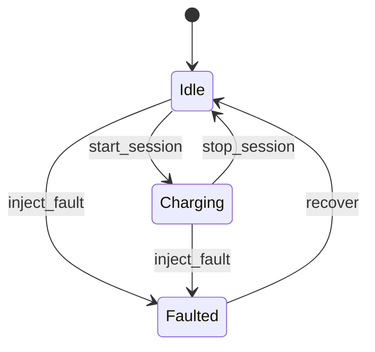

# Controller protocol

## Transport

The controller listens only on IPv4 loopback TCP at `127.0.0.1`. One compact UTF-8 JSON object followed by `\n` is one frame. Frames are capped at 65,536 bytes, idle receives time out after two seconds, and an incomplete request connection is capped at five seconds.

The protocol permits exactly one request and one response per connection. The server closes the connection after the response (or immediately for a disconnect fault), which bounds request work and matches the reference Python client.

## Request envelope

```json
{
  "version": 1,
  "request_id": "caller-generated-id",
  "command": "status"
}
```

- `version` must be integer `1`.
- `request_id` must be a non-empty string no longer than 128 characters.
- `command` must be one of the commands below.
- Unknown commands and invalid fields fail closed with a structured error.

## Response envelope

```json
{
  "version": 1,
  "request_id": "caller-generated-id",
  "success": true,
  "controller_id": "charger-0",
  "data": {
    "state": "idle"
  },
  "error": null
}
```

Failures set `success` to `false`, `data` to `null`, and return an error object:

```json
{
  "code": "invalid_state",
  "message": "power can only be allocated while charging"
}
```

Stable error codes are `invalid_json`, `invalid_request`, `unsupported_version`, `unknown_command`, and `invalid_state`.

## Commands

### `health` and `status`

No additional fields. Returns the immutable controller snapshot.

### `start_session`

```json
{"vehicle_id": "vehicle-42"}
```

Valid only while idle. Controller and vehicle IDs are 1–128 characters using letters, numbers, `.`, `:`, `_`, or `-`.

### `allocate_power`

```json
{"requested_power_kw": 200.0}
```

Valid only while charging. The request must be finite and positive. The returned allocation is capped at the configured controller maximum.

### `stop_session`

No additional fields. Valid only while charging. Clears the active vehicle and allocated power.

### `inject_fault`

```json
{"kind": "delay", "duration_ms": 250}
```

`kind` is `delay`, `disconnect`, or `corrupt`. Delay is bounded to 30,000 ms. Disconnect and corrupt require `duration_ms: 0`. Every fault immediately transitions the domain state to `faulted` and clears allocated power before applying the transport effect.

### `recover`

No additional fields. Valid only while faulted. Clears the session and active fault and returns to idle.

### `shutdown`

No additional fields. Returns an acknowledgment, closes the current connection, and stops the listener.

## State machine


